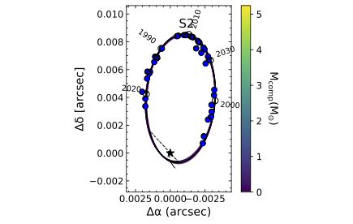

# black-hole-stellar-orbits

Relative astrometry and orbit fit of star S2 around the black hole Sagittarius A*

Orbit fit is handled by the `fit_orbit` module which was written by G. Mirek Brandt, Daniel Michalik, Gavin K. Hung as a part of their HTOF package: https://github.com/gmbrandt/HTOF

The astrometric measurements of S0-2 are from https://arxiv.org/pdf/1607.05726.pdf on 2022/06/21.

## Program Output



## Usuage
```
fit_orbit --output-dir output/chains output/config_s2.ini
plot_orbit --output-dir output/plots output/config_s2.ini 
```

## License

MIT License. See the LICENSE file for more information.
